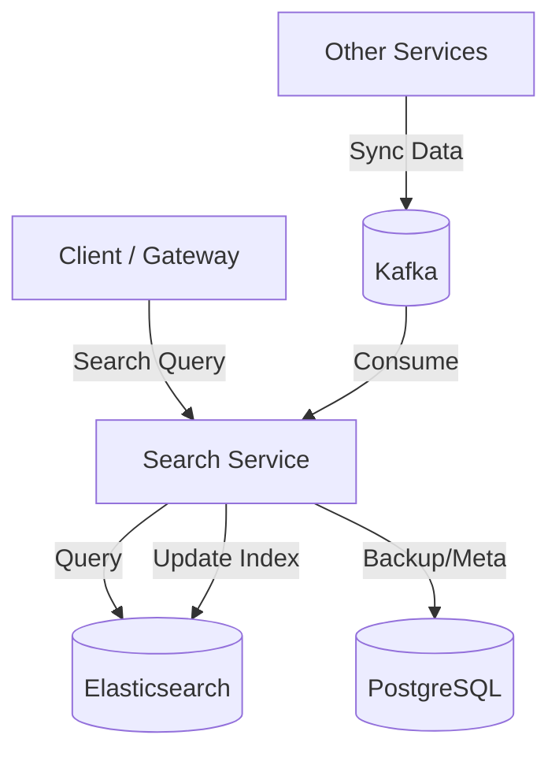

# Search Service

**Offeria — a product by [Al‑Wahha Al‑Sehriya](https://github.com/Al-Wahha-Al-Sehriya).**

[Company website](https://wahasehriya.com/) · [Offeria repositories](https://github.com/offeria-io)

## Description
The Search Service provides high-performance searching and filtering for materials and RFQs in the Offeria platform. It leverages Elasticsearch to index data and provide full-text search capabilities.

## Architecture Diagram


## File Structure
```text
search-service/
├── k8s/                  # Kubernetes manifests
├── src/
│   ├── main/
│   │   ├── java/offeria/search_service/
│   │   │   ├── config/      # Spring & Elasticsearch Configuration
│   │   │   ├── controller/  # Search REST endpoints
│   │   │   ├── domain/      # Indexed entities
│   │   │   ├── dto/         # Request/Response data
│   │   │   ├── exception/   # Custom exceptions
│   │   │   ├── mapper/      # Object mapping
│   │   │   ├── messaging/   # Kafka consumers for indexing
│   │   │   ├── repository/  # ES & JPA Repositories
│   │   │   ├── service/     # Search logic
│   │   │   └── SearchServiceApplication.java
│   │   └── resources/       # Configuration
│   └── test/                # Unit tests
├── Dockerfile           # Docker configuration
└── pom.xml              # Maven dependencies
```

## Technologies
- **Java 17**
- **Spring Boot 3**
- **Elasticsearch**
- **Spring Data Elasticsearch**
- **Spring Data JPA**
- **Spring Kafka**
- **PostgreSQL**
- **Maven**

## Key Dependencies
- `spring-boot-starter-data-elasticsearch`: Integration with Elasticsearch.
- `spring-kafka`: Consuming updates to keep search indexes in sync.
- `spring-cloud-starter-netflix-eureka-client`: Discovery client.

## Environment Variables
- `SPRING_PROFILES_ACTIVE`: Active profile.
- `EUREKA_CLIENT_SERVICEURL_DEFAULTZONE`: Discovery Service URL.
- `DB_URL`: JDBC URL for PostgreSQL.
- `DB_USERNAME`: PostgreSQL username.
- `DB_PASSWORD`: PostgreSQL password.
- `ELASTICSEARCH_URIS`: Elasticsearch server URIs.
